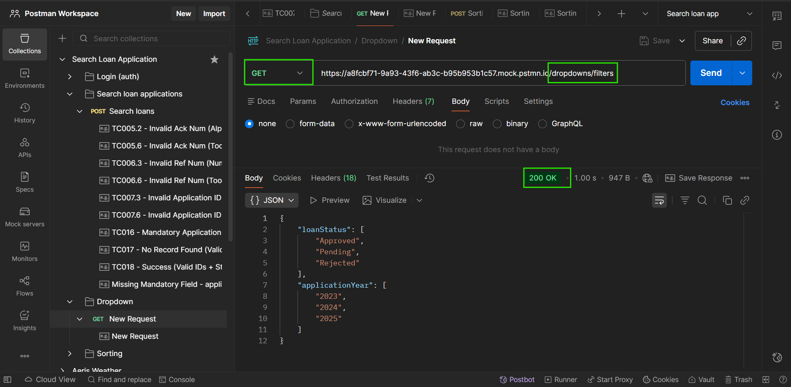

## Endpoint reference (detailed)

All request and response bodies are JSON unless otherwise stated. For each endpoint below you'll find:

- API path
- Short one-line description
- Positive and negative cases for: Request type, Request body, Response body, Status code

## DROPDOWN API – SCHEMAS

**Model: Dropdown Response**
|Field	|Type	|Description|
|-------|-------|-----------|
|loanStatus	|array<LoanStatus>	|List of Loan application status|
|applicationYear	|array<ApplicationYear>	|List of application year|


**Dropdown Response**

oanStatus: `array<LoanStatus>`  
applications: `array<ApplicationYear>`  

## Dropdown options
- **URL:** `/dropdown/filters`  
- **Method:** `GET`  
- **Description:** This API will returns the loan application status and application year dropdown options that is available in the search filter. Positive case returns 200 OK.

### Example:

**Response:**
```json
{
  "loanStatus": ["Approved", "Pending", "Rejected"],
  "applicationYear": ["2023", "2024", "2025"]
}
```
