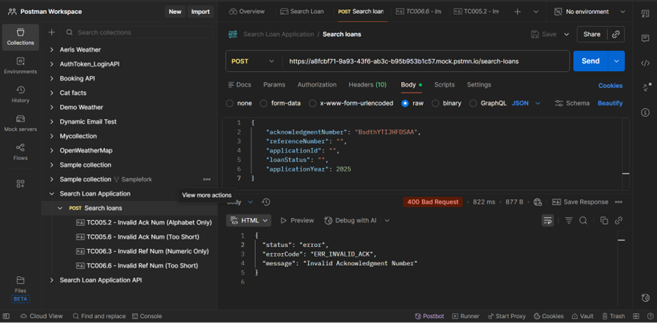
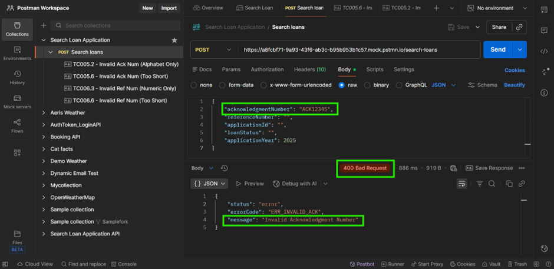
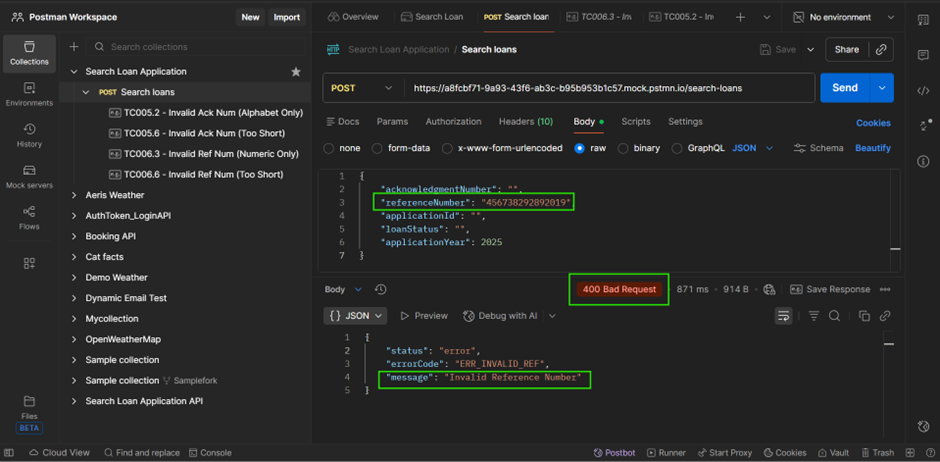
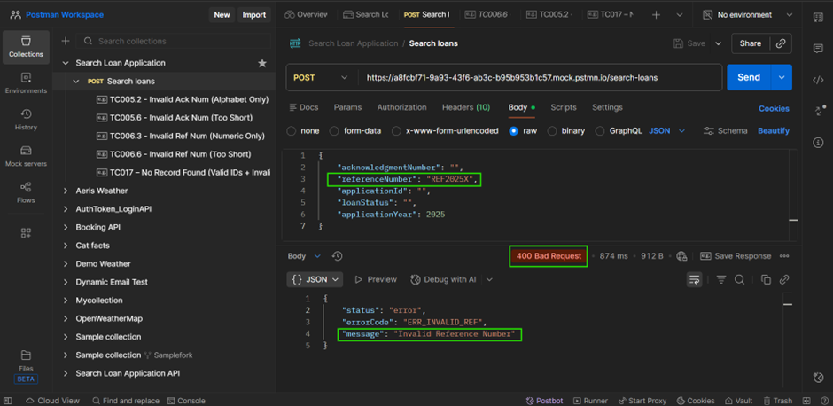
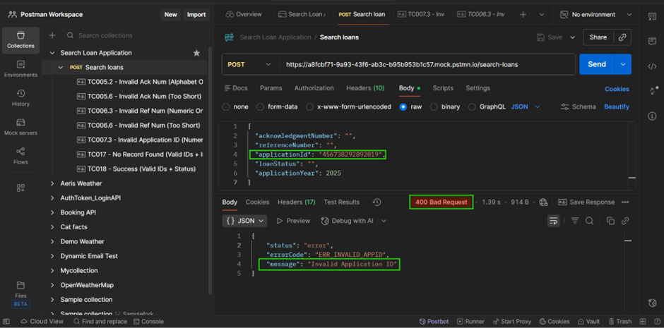
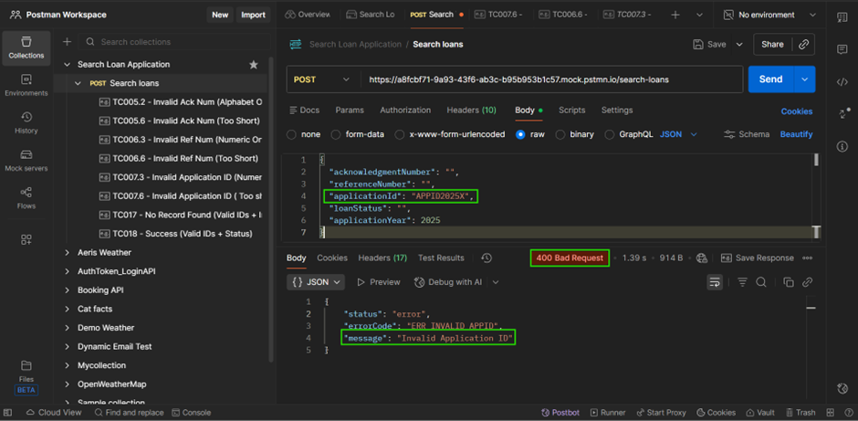
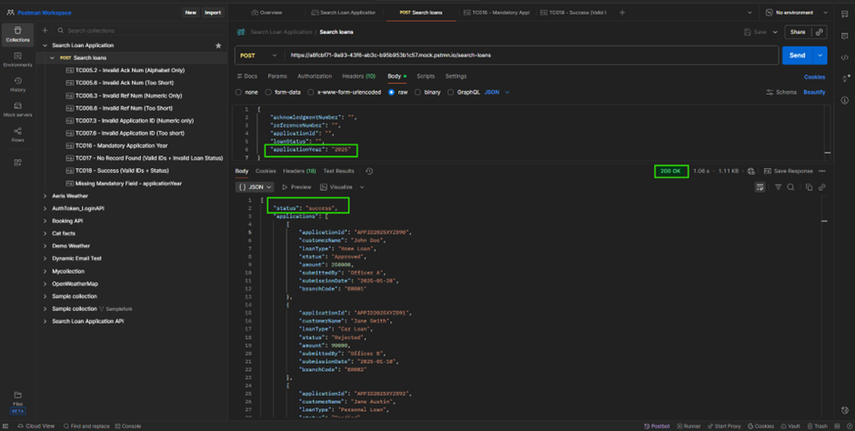
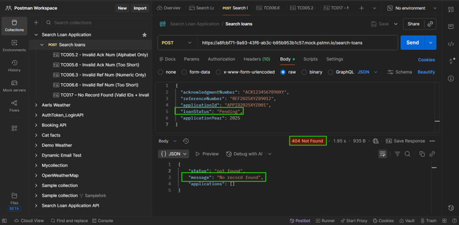
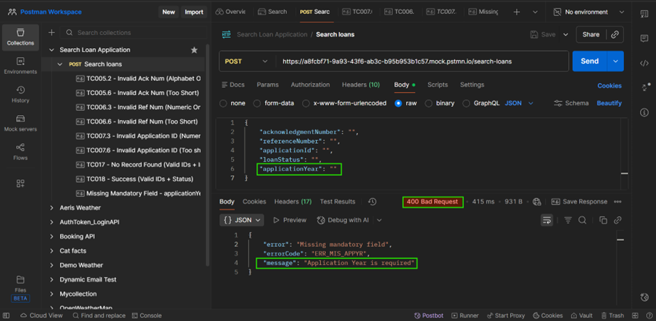

## Endpoint reference (detailed)

All request and response bodies are JSON unless otherwise stated. For each endpoint below you'll find:

- API path
- Short one-line description
- Positive and negative cases for: Request type, Request body, Response body, Status code

## SEARCH API – SCHEMAS

**Model: SearchRequest**

|Field	|Type	|Required	|Description|
|-------|-------|-----------|-----------|
|acknowledgmentNumber	|string	|no	|1–15 alphanumeric, case-insensitive|
|referenceNumber	|string	|no	|1–15 alphanumeric, case-insensitive|
|applicationId|string	|no	|1–15 alphanumeric, case-insensitive|
|loanStatus|string| no|One of: Approved, Pending, Rejected|
|applicationYear | number| yes | Allowed: 2023, 2024, 2025. Default: 2025|

**SearchRequest**

acknowledgmentNumber: `string (1–15 alphanumeric)`  
referenceNumber: `string (1–15 alphanumeric)`  
applicationId: `string (1–15 alphanumeric)`  
loanStatus: `string (enum: Approved, Pending, Rejected)`  
applicationYear: `number (required, enum: 2023 | 2024 | 2025; default=2025)`  


**Model: SearchResponse**
|Field	|Type	|Description|
|-------|-------|-----------|
|status	|string	|Response status.|
|applications	|array<ApplicationRecord>	|List of loan applications matching the criteria.|


**Model: ApplicationRecord**
|Field	|Type	|Description|
|-------|-------|-----------|
|applicationId	|string	|Unique ID of the loan application.|
|customerName	|string	|Customer’s full name.|
|loanType	|string	|Type of loan (e.g., Home Loan).|
|status	|string	|Application status.|
|amount	|number	|Loan amount approved/requested.|
|submittedBy	|string	|Loan officer who created the application.|
|submissionDate	|string (YYYY-MM-DD)	|Date of submission.|
|branchCode	|string	|Branch identifier.|


**SearchResponse**

status: `string`  
applications: `array<ApplicationRecord>`  


ApplicationRecord:  
  applicationId: `string`  
  customerName: `string`  
  loanType: `string`  
  status: `string`  
  amount: `number`  
  submittedBy: `string`  
  submissionDate: `string (YYYY-MM-DD)`  
  branchCode: `string`  

## Search loan applications
- **URL:** `/search-loans`  
- **Method:** `POST`  
- **Description:** This API will fetch the loan application details that match the provided criteria or filters applied. Positive case returns 200 OK.Negative cases: returns (400 Bad Request). 

### Examples:

**TC005.2 - Invalid Ack Num (Alphabet Only)**

**Request:** 
```json
{
    "acknowledgmentNumber": "BsdthYTIJHFDSAA",
    "referenceNumber": "",
    "applicationId": "",
    "loanStatus": "",
    "applicationYear": 2025
}
```
**Response:**
```json
{
  "status": "error",
  "errorCode": "ERR_INVALID_ACK",
  "message": "Invalid Acknowledgment Number"
}
```


**TC005.6 - Invalid Ack Num (Too Short)**

**Request:**
```json
{
    "acknowledgmentNumber": "ACK12345",
    "referenceNumber": "",
    "applicationId": "",
    "loanStatus": "",
    "applicationYear": 2025
}
```
**Response:**
```json
{
  "status": "error",
  "errorCode": "ERR_INVALID_ACK",
  "message": "Invalid Acknowledgment Number"
}
```


**TC006.3 - Invalid Ref Num (Numeric Only)**

**Request**
```json
{
    "acknowledgmentNumber": "",
    "referenceNumber": "456738292892019",
    "applicationId": "",
    "loanStatus": "",
    "applicationYear": 2025
}
```
**Response:**
```json
{
  "status": "error",
  "errorCode": "ERR_INVALID_ACK",
  "message": "Invalid Acknowledgment Number"
}
```


**TC006.6 - Invalid Ref Num (Too Short)**

**Request**
```json
{
    "acknowledgmentNumber": "",
    "referenceNumber": "REF2025X",
    "applicationId": "",
    "loanStatus": "",
    "applicationYear": 2025
}
```
**Response:**
```json
{
  "status": "error",
  "errorCode": "ERR_INVALID_ACK",
  "message": "Invalid Acknowledgment Number"
}
```


**TC007.3 - Invalid Application ID (Numeric only)**

**Request:**
```json
{
  "acknowledgmentNumber": "",
  "referenceNumber": "",
  "applicationId": "456738292892019",
  "loanStatus": "",
  "applicationYear": 2025
}
```
**Response:**
```json
{
  "status": "error",
  "errorCode": "ERR_INVALID_ACK",
  "message": "Invalid Acknowledgment Number"
}
```


**TC007.6 - Invalid Application ID (Too short)**

**Request:**
```json
{
  "acknowledgmentNumber": "",
  "referenceNumber": "",
  "applicationId": "APPID2025X",
  "loanStatus": "",
  "applicationYear": 2025
}
```
**Response:**
```json
{
  "status": "error",
  "errorCode": "ERR_INVALID_ACK",
  "message": "Invalid Acknowledgment Number"
}
```


**TC016 - Mandatory Application Year**

**Request:**
```json
{
    "acknowledgmentNumber": "",
    "referenceNumber": "",
    "applicationId": "",
    "loanStatus": "",
    "applicationYear": "2025"
}
```
**Response:**
```json
{
  "status": "success",
  "applications": [
    {
      "applicationId": "APPID2025XYZ890",
      "customerName": "John Doe",
      "loanType": "Home Loan",
      "status": "Approved",
      "amount": 250000,
      "submittedBy": "Officer A",
      "submissionDate": "2025-01-20",
      "branchCode": "BR001"
    },
    {
      "applicationId": "APPID2025XYZ891",
      "customerName": "Jane Smith",
      "loanType": "Car Loan",
      "status": "Rejected",
      "amount": 90000,
      "submittedBy": "Officer B",
      "submissionDate": "2025-01-10",
      "branchCode": "BR002"
    },
    {
      "applicationId": "APPID2025XYZ892",
      "customerName": "Jane Austin",
      "loanType": "Personal Loan",
      "status": "Pending",
      "amount": 90000,
      "submittedBy": "Officer B",
      "submissionDate": "2025-01-11",
      "branchCode": "BR002"
    }
  ]
}
```


**TC017 – No Record Found (Valid IDs + Invalid Loan Status)**

**Request:**
```json
{
  "acknowledgmentNumber": "ACK1234567890XY",
  "referenceNumber": "REF2025XYZ89012",
  "applicationId": "APPID2025XYZ001",
  "loanStatus": "Pending",
  "applicationYear": 2025
}
```

**Response(404 Not Found):**
```json
{
  "status": "not_found",
  "message": "No record found",
  "applications": []
}
```


**TC018 - Success (Valid IDs + Status)**
**Request:**
```json
{
  "acknowledgmentNumber": "ACK1234567890XY",
  "referenceNumber": "REF2025XYZ89012",
  "applicationId": "APPID2025XYZ001",
  "loanStatus": "Appoved",
  "applicationYear": 2025
}
```
**Response(200 OK):**
```json
{
  "status": "success",
  "applications": [
    {
      "applicationId": "APPID2025XYZ001",
      "customerName": "John Doe",
      "loanType": "Home Loan",
      "status": "Approved",
      "amount": 250000,
      "submittedBy": "Officer A",
      "submissionDate": "2025-01-20",
      "branchCode": "BR001"
    }
  ]
}
```


**Missing Mandatory Field - applicationYear**

**Request:**
```json
{
    "acknowledgmentNumber": "",
    "referenceNumber": "",
    "applicationId": "",
    "loanStatus": "",
    "applicationYear": ""
}
```
**Response:**
```json
{
  "error": "Missing mandatory field",
  "errorCode": "ERR_MIS_APPYR",
  "message": "Application Year is required"
}
```


